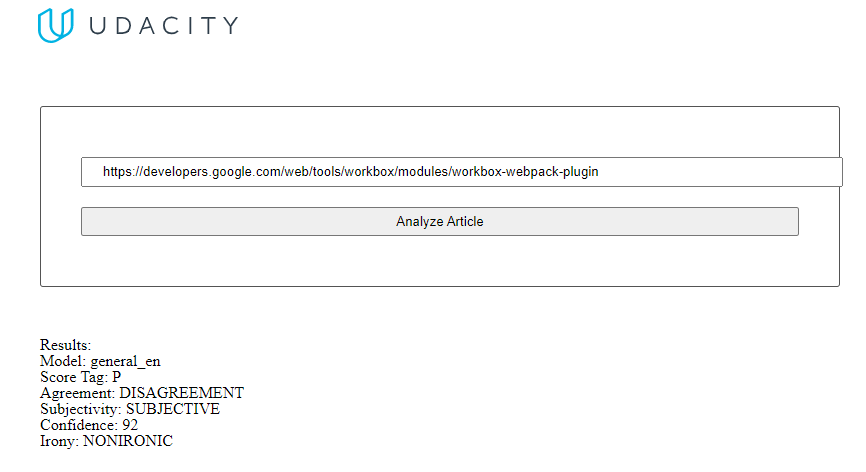

# Evaluate News using NLP

This Udacity's project allows users to run Natural Language Processing (NLP) on articles or blogs found on other websites for analyze using MeaningCloud API.



## Project Set Up and Installation

use npm:

```
npm install
```

or just use yarn:

```
yarn
```

## Documentation

To run the project use commands as follow:

| Command         | Description                               |
| --------------- | ----------------------------------------- |
| yarn test       | run test using jest                       |
| yarn start      | start node express server                 |
| yarn build-prod | build files to dist folder for production |
| yarn build-dev  | run live server for development           |
